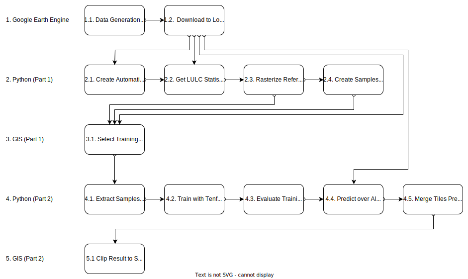
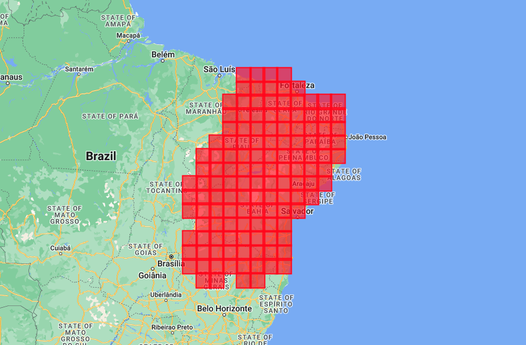
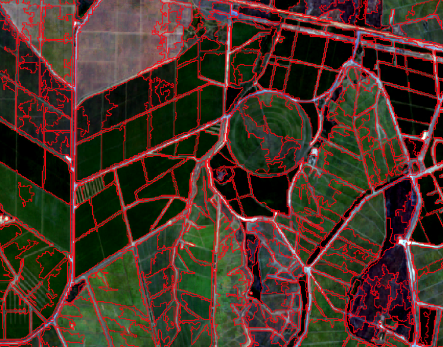
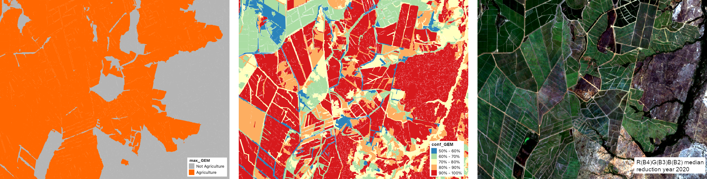
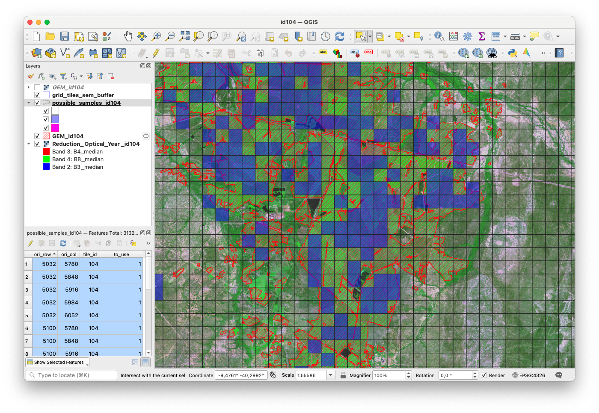
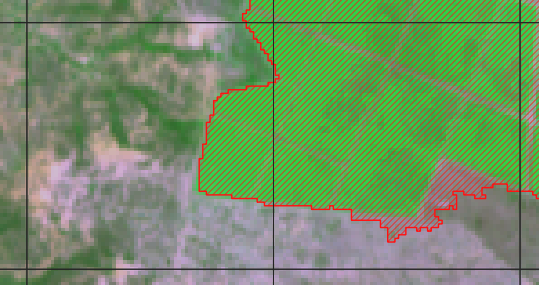
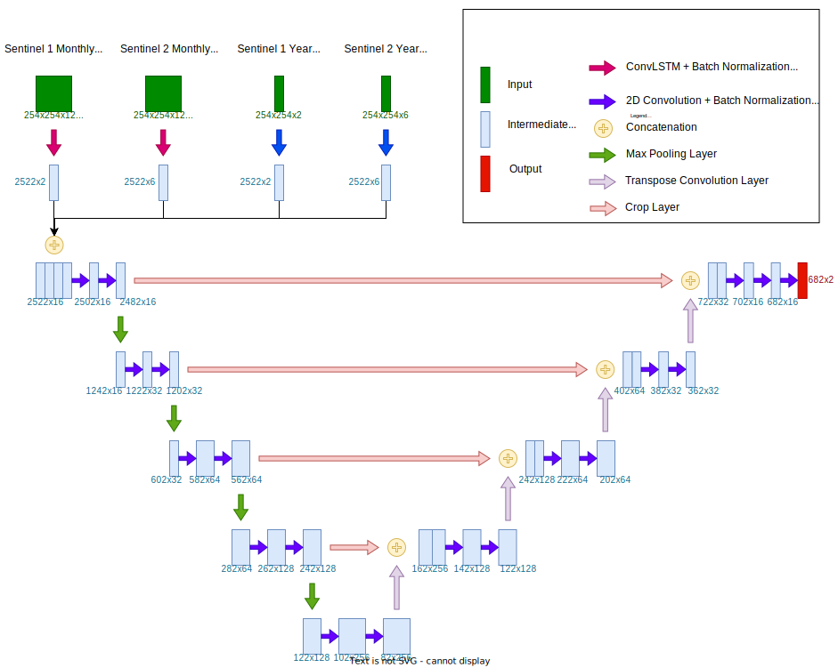
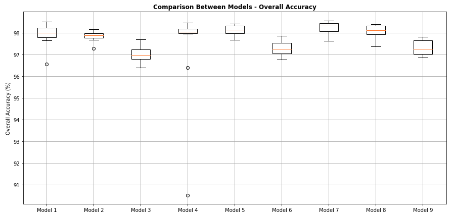
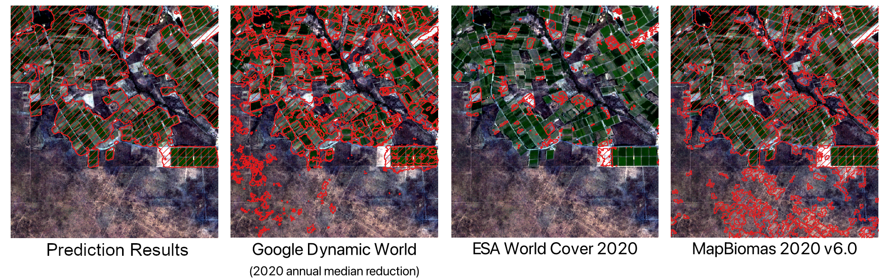

# Brazilian Semiarid Agriculture Detection User Manual

The methodology here described aims to provide the means to detect agriculture in continental areas in Brazil, developed in the context of the Brazilian Semiarid region. One aspect that influenced this methodology is the pertinent presence of clouds in some areas, which induced the adoption of time series data, from optical and Synthetic Aperture Radar (SAR) sensors. All scripts used in the methodology are presented here with values adapted to be used for the Brazilian Semiarid, in order to map agriculture for the year 2020, however, changes can easily be done to adapt it to create other Land Use and Land Cover (LULC) maps for other regions. The following text briefly explains concepts adopted, as well as why they were used.

The following table of contents represents the steps involved in the methodology, as well as Figure 1:

+ 1. [Google Earth Engine](#1.)
    + 1.1. [Data Generation in Tiles](#1.1.)
    + 1.2. [Download Files From Drive to Local](#1.2.)
+ 2. [Python (Part 1)](#2.)
    + 2.1. [Create Automatic Segmentation](#2.1.)
    + 2.2. [Get LULC Statistics for Segmentation Polygons](#2.2.)
    + 2.3. [Rasterize Data](#2.3.)
    + 2.4. [Create Samples Grid](#2.4.)
+ 3. [GIS (Part 1)](#3.)
    + 3.1. [Select Training Samples](#3.1.)
+ 4. [Python (Part 2)](#4.)
    + 4.1. [Extract Samples Values from Selected Samples](#4.1.)
    + 4.2. [Train with Tenfold Cross-Validation](#4.2.)
    + 4.3. [Evaluate Trainings](#4.3.)
    + 4.4. [Predict over All Tiles of Study Area](#4.4.)
    + 4.5. [Merge Tiles Predictions](#4.5.)
+ 5. [GIS (Part 2)](#5.)
    + 5.1. [Clip Result to Study Area](#5.1.)

|  | 
|:--:| 
| Figure 1: Methodology topics summarization with their dependencies shown with arrows.|

## 1. Google Earth Engine 

The first main block of steps involve the use of cloud computing, provided by the [Google Earth Engine](https://earthengine.google.com) platform. Although it has its own programming interface for using the JavaScript language, its Python API was used to access this platform and submit requests for processing.

### 1.1. _Data Generation in Tiles_ 

The data generation is made with script **01 - Pre-Process Data with Google Earth Engine.ipynb**. The Semiarid was divided into tiles of approximately 1°, with 0.1° of overlay. Figure 2 shows the grid created. 

|  |
|:--:| 
| Figure 2: Tiles created for mapping the Semiarid region in Brazil.|

This grid is publicly available in Google Earth Engine under `users/brunomenini10/Grid_Semiarido` and can be used by anyone.

Four different types of satellite data were created in this step:
+ Sentinel-1 median image for the year 2020 (VV, VH);
+ Sentinel-2 median image for the year 2020 (B2, B3, B4, B8, B11, B12);
+ Sentinel-1 time series composed of monthly median images for the year 2020 (VV, VH); and
+ Sentinel-2 time series composed of monthly median images for the year 2020 (B2, B3, B4, B8, B11, B12).

The time series are stored separated in stacks according to their bands (i.e. one .TIF file with 12 B2 bands, one for every month), while the yearly reductions are separated in files according to sensor (i.e. one .TIF file with bands VV and VH). 

LULC data is also preprocessed in this step. Three different sources are reclassified using Google Earth Engine as well:
+ [MapBiomas](https://mapbiomas.org) (v6.0)
+ [Google Dynamic World](https://developers.google.com/earth-engine/datasets/catalog/GOOGLE_DYNAMICWORLD_V1) (v1)
+ [ESA world Cover](https://developers.google.com/earth-engine/datasets/catalog/ESA_WorldCover_v100) (v100)

These maps are reclassified to encompass only the classes _Agriculture_ and _Not Agriculture_. They are also saved in one single .TIF with each source separated into a band. Since Google Dynamic World data has multiple classifications along the year, a reduction is created with the class most present during the year for every pixel.

All data generated in this step is stored in Google Drive.

### 1.2. _Download Files From Drive to Local_  

After satellite data preprocessing is completed, resulting files are transferred to where they are to be processed using Python. This can be done manually, but can also be automated using tools like [Rclone](https://rclone.org).

## 2. Python (Part 1)

The next block of steps is made using Python and some of its well known libraries. The main objective of this block is to create data needed for the selection of training samples' locations.

### 2.1. _Create Automatic Segmentation_ 

The first step of block 2 is to create an automatic segmentation using the Sentinel-2 median image for the year 2020. This is made with script **02 - Create Segmentation and Generate LULC Statistics.ipynb**. The segmentation algorithm used was developed by [J. D. Shepherd, P. Bunting, and J. R. Dymond (2019)](http://doi.org/10.3390/rs11060658) and is totally automated. A segmentation is created for all tiles available first in the raster format, and later converted to vectors in a shapefile data structure. Figure 2 shows an example of segmentation generated for an area with agriculture cover.

|  | 
|:--:| 
| Figure 2: Segmentation example over an area of agriculture. Red lines represent polygons borders.|

### 2.2. _Get LULC Statistics for Segmentation Polygons_ 

Script **02 - Create Segmentation and Generate LULC Statistics.ipynb** also creates statistics for every segment based on the LULC data created before. For every polygon, it is calculated how many pixels are classified as _Agriculture_ or _Not Agriculture_ according to MapBiomas, Google Dynamic World, and ESA World Cover. The script then proceeds to obtain the percentage of each class inside the polygon according to these three sources.

The following fields are created in every segmentation's shapefile to hold a different statistic:
|Metrics Fields|Description| 
|:-------|:-------|
|`qt_0_GDC`| Quantity of _Not Agriculture_ pixels according to Google Dynamic World|
|`qt_0_ESA`| Quantity of _Not Agriculture_ pixels according to ESA World Cover|
|`qt_0_MB`| Quantity of _Not Agriculture_ pixels according to MapBiomas|
|`qt_1_GDC`| Quantity of _Agriculture_ pixels according to Google Dynamic World|
|`qt_1_ESA`| Quantity of _Agriculture_ pixels according to ESA World Cover|
|`qt_1_MB`| Quantity of _Agriculture_ pixels according to MapBiomas|
|`0_GEM`| Sum of `qt_0_GDC`, `qt_0_ESA`, and `qt_0_MB`|
|`1_GEM`| Sum of `qt_1_GDC`, `qt_1_ESA`, and `qt_1_MB`|
|`0_GM`| Sum of `qt_0_GDC` and `qt_0_MB`|
|`1_GM`| Sum of `qt_1_GDC` and `qt_1_MB`|
|`max_GEM`| Class of the majority of pixels within the polygon, 0 to _Not Agriculture_ and 1 to _Agriculture_, obtained by comparing `0_GEM` and `1_GEM`|
|`conf_GEM`| The percentage of `max_GEM` pixels within the polygon|
|`max_GM `| Class of the majority of pixels within the polygon, 0 to _Not Agriculture_ and 1 to _Agriculture_, obtained by comparing `0_GM` and `1_GM`|
|`conf_GM`| The percentage of `max_GM` pixels within the polygon|

Figure 3 shows an example for `max_GEM` and `conf_GEM` in comparison to the annual median reduction.

||
|:-------|
|Figure 3: Statistics example. First `max_GEM`, second `conf_GEM`, and third a color composition of sentinel-2 median reduction for year 2020.|

### 2.3. _Rasterize Data_ 

The next step is to rasterize the segmentations, according to their statistics. This is done in order to create lightweight reference files, as well as prepare them to be used during samples selection and sample data extraction. This step is accomplished by using script **03 - Rasterize Reference.ipynb**.

In the rasterization process, the field `max_GEM` is used to create a map with the polygons where the majority of pixels provided by the three LULC sources is _Agriculture_. This map represents the agreement between these sources and has a low rate of false positives. It cannot be used as reference to automatically select training samples because of its high false negatives rate, but it later helps accelerate the process of manually select samples.

### 2.4. _Create Samples Grid_ 

This is the last step of block 2. It aims to create a grid of possible samples, from which the user manually selects the ones to be used in training. This step is done by using script **04 - Create SHP with Possible Samples.ipynb**. In the end, one shapefile is created for each tile. For the Brazilian Semiarid map, it was defined that input samples would be squares of 256x256 pixels, which after being submitted to the model would result in an output of 68x68 pixels. The result is smaller than the input and is located exactly at the center of the sample, and it is the portion that need reference during training, so polygons generated in possible samples grid represent these smaller 68x68 pixels areas, but the final samples are larger, with 256x256 pixels each.

## 3. GIS (Part 1)

After creating reference files in last block, training samples are selected form the options offered. In this block, a GIS like QGIS or ArcGIS is used.

### 3.1. _Select Training Samples_ 

This step can be changed and edited to a version more adapted to the analyst conducting it, but an example of setup is given here as a starting point. The main idea is to visually compare the reference maps created in [2.3.](#2.3.) with optical data, like the year median reduction created in [1.1.](#1.1.), in order to select samples from the grid created in [2.4.](#2.4.) with appropriate reference.

An overlay of data is made using a GIS software to visually compare the samples. The first layer to add is the year reduction of sentinel-2 created in [1.1.](#1.1.), because it is more recommended for visual interpretation of LULC. For this layer, the RGB bands and contrast adjustment method can be selected by the user for their convenience. The second layer to add is Agriculture reference, created in [2.3.](#2.3.), that is used as samples' reference. This reference is a raster file, but in order to see Agriculture's contours and optical data under it, it is recommended to vectorize it first. The symbology used can be red contours, with lines filling and transparent background. The last layer to add is the samples grid created in [2.4.](#2.4.). In this layer, each sample location is a polygon and a new attribute must be created named `to_use`, initiated with all values equal to zero and when changed to one (1), it represents that the sample is to be used during training. This attribute also allows to create conditional symbology, for example, samples not to be used can be configured with transparent fill color while samples to be used are represented with a bright blue fill color. This helps see a potential sample that has correct reference and can be used during training. Figure 4 shows an example of setup used in QGIS for the samples selection.

||
|:-------|
|Figure 4: Example of samples selection's setup in QGIS. Samples from the grid to be used are in blue slightly transparent.|

The process of selecting samples consists mainly of visually identifying samples with good agriculture identification in the reference, then change its `to_use` value from zero to one. It is very important to be cautious in this step, because the quality of these samples directly influences the quality of the final map. For example, even if most of reference for a sample is correct, it is still not recommended to include it. The inclusion must be done only when the whole sample's area has correct reference. Figure 5 exemplifies a sample to be selected and a sample to not be selected. The sample on the left has agriculture's contours well defined and separates properly the regions of _Agriculture_ from regions of _Not Agriculture_ for the entire area, on the other hand, the sample on the left has a region of confusion on its south-eastern portion, and must be left out of training. 

||
|:-------|
|Figure 5: Example of sample to be selected for training (left) in comparison to sample not to be selected (right).|

Since processing is made using tiles, the final result of this step is obtained by merging all grids of all tiles into a single shapefile, and deleting samples' polygons that are not to be used during training from it (`to_use` equals to zero).

## 4. Python (Part 2)

The fourth block of steps is made using Python once again and some of its well known libraries. The main objective of this block is to train multiple models, compare them, and then create an agriculture map for the entire study area.

### 4.1. _Extract Samples Values from Selected Samples_ 

In this first step, data is obtained for each selected sample delimited in step [3.1.](#3.1.). To do this, script **05 - Extract Samples Values.ipynb** is used.

The script iterates through every sample and extracts its values from data previously created in [1.1.](#1.1.), it shuffles these samples and also scales them between zero and one. The shuffling is done in order to reduce bias that may influence training, in case similar samples originated from close locations are submitted in succession. The scaling is performed in order to adjust samples according to TensorFlow recommendations. The scaling is done according to each band's histogram, and is essential to use the same scaling factors to all data that is submitted to the model during training and prediction. Thus, scaling factors are stored separately, so they can be accessed again later during the prediction phase ([4.4.](#4.4.)). Furthermore, the script takes into consideration which tile the samples are in, using data provided in the attributes of samples grid.

### 4.2. _Train with Tenfold Cross-Validation_ 

In this step, the samples files created in step [4.1.](#4.1.) are used to train models following a [tenfold cross-validation](https://www.kdnuggets.com/2018/01/training-test-sets-cross-validation.html) scheme, using script **06 - Train Model with Tenfold Cross-Validation.ipynb**. The model architecture takes advantage of ConvLSTM and 2D Convolution layers to process monthly reduction time series and year reduction images, respectively. The results are then concatenated and submitted to a scheme of convolution, concatenation, max pooling, transpose convolution, and crop layers, inspired by the U-Net proposed by [O. Ronnenberger, P. Fischer, and T. Brox (2015)](https://doi.org/10.1007/978-3-319-24574-4_28). Figure 6 shows the model's layers and its activation shapes. Training samples are defined in squares of 256 by 256 pixels, resulting in a final output size of 68 by 68 pixels, centered in the sample.

||
|:-------|
|Figure 6: Layers defined for the model used and its activations shapes.|

Before training, hyperparameters like learning rate and epochs must be defined. Different hyperparameters result in different models, with different accuracies, so they must be optimized. One way of optimizing them is by training models with multiple combinations of hyperparameters and then make a comparison using metrics like Categorical Accuracy or F1-Score. A suggestion is to train nine different models with every combination between learning rate equal to 0.001, 0.0001, and 0.00001, as well as number of epochs equal to 50, 100, and 200. For every model, 10 different trainings are created, for every step of the tenfold cross-validation. More combinations of hyperparameters should be tested, however, the model defined can take a long time to train, making the process unfeasible. 

### 4.3. _Evaluate Trainings_ 

After training with different hyperparamertes, it is important to compare how the models performed, to know which one had the best combination available. In this analysis, script **07 - Compare Models.ipynb** is used.

Dufring training, the test dataset was used in a prediction procedure and compared with reference. This enables creating confusion matrices, which are used to derive metrics like Accuracy and F1-Score. The script provides tools like graph's creation, load confusion matrix, among others.

||
|:-------|
|Figure 7: Figure generated with script 07, showing a comparison between models' overall accuracy, using boxplots.|

### 4.4. _Predict over All Tiles of Study Area_ 

After evaluating trained models, one of them must be chosen to predict over all tiles. This step is made using script **08 - Prediction.ipynb** and aims to submit all data from the study area to a model, in order to generate the final agriculture map. This step is done for every tile, breaking every tile in batches of samples with the same size as the training samples. This step can take a lot of time to be executed, so it is recommended to predict only some important tiles first, and then committing to the completion of the whole map. Figure 8 shows an example of this prediction in comparison to maps generated by other initiatives.

||
|:-------|
|Figure 8: Comparison of the prediction results with Google Dynamic World, ESA world Cover and MapBiomas for an agriculture area near Juazeiro and Petrolina, Brazil.|

### 4.5. _Merge Tiles Predictions_ 

After predicting over all tiles, the results are stores in separated files, which must be merged into a complete map. This procedure can be done in a GIS software, but script **09 - Merge All Predictions.ipynb** can be used to automate the process. This script results in a single .tif file with the agriculture mapping for the study area, where 1 represents *Agriculture* and 0 represents *Not Agriculture*.

## 5. GIS (Part 2)

This is the last step in the methodology and is optional. After predicting over all tiles, there are some parts that do not belong to Semiarid and must be removed.

### 5.1 _Clip Result to Study Area_ 

To remove predictions made outside the study area, a GIS can be used to clip the final .TIF file. In QGIS, for example, the option to clip a raster file with a shapefile can be found under Raster > Extraction > Clip Raster by Mask Layer, or by searching "Clip Raster by Mask Layer" in the toolbox.